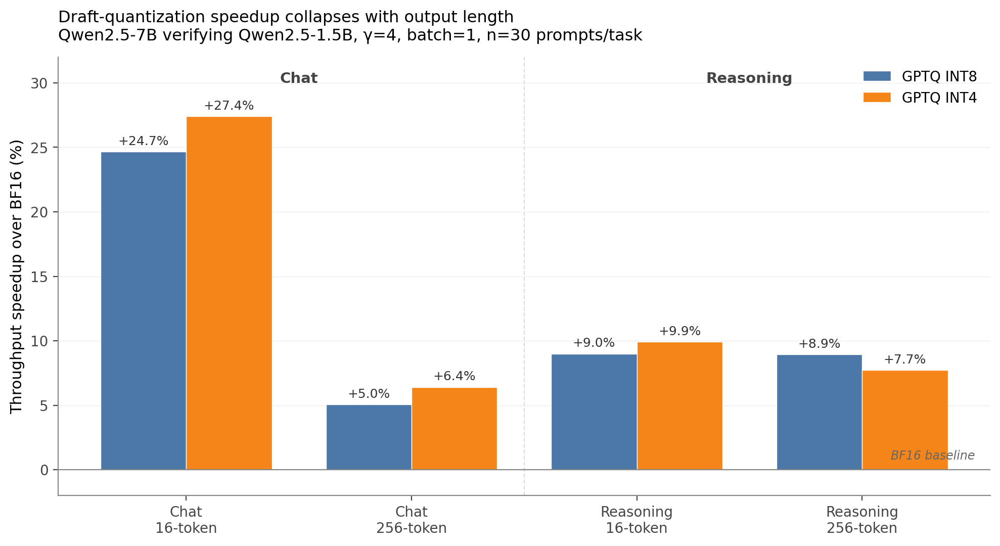

# When Do Quantized Drafts Help Speculative Decoding?

This pilot studies a narrower question than QSPEC [[1]](#ref-qspec) tackles: in *standard* heterogeneous speculative decoding - a smaller draft verified by a larger target [[2]](#ref-leviathan), [[3]](#ref-chen) - how much does draft-side quantization alone actually buy?

Current pilot setup:

- target/draft: Qwen2.5-7B-Instruct verifies Qwen2.5-1.5B-Instruct
- path: vLLM [[5]](#ref-vllm) draft + HF target verification
- fixed settings: γ=4, batch=1, max_new_tokens=256
- varied setting: BF16, GPTQ INT8, GPTQ INT4 draft precision

Main takeaway:

- INT8 preserves BF16-like acceptance with +5.1% chat / +8.9% reasoning throughput.
- INT4 gives +6.4% chat / +7.7% reasoning throughput, but lowers acceptance.
- The 16-token run overstated the gain at about +27%, so output length became the main methodology lesson.
- The measurements point toward the same intuition QSPEC Section 3.2 frames analytically through Eq. 3 (`v ~ C(k)/H(k)`): in heterogeneous SD without shared weights, the cheap draft-precision gains appear to saturate well below the 1.64× headroom QSPEC's design exploits.

## See More / Runbook

[`notes/README.md`](notes/README.md)

## Headline result

At γ=4 with 16 max-new-tokens, a run is roughly four speculation cycles plus warm-up - the regime where draft cost looks artificially cheap. The 256-token regime is where draft cost actually accumulates, and the gap there is small.

## What is included

- A four-stage measurement harness: target-only baseline → speculative run → quality backfill → aggregation with bootstrap CIs on acceptance, position-wise acceptance, throughput, draft cost share, and task EM. Entry points: `scripts/run_sd.py` (HF) and `scripts/run_sd_vllm_draft.py` (vLLM draft + HF target).
- An isolated `.venv-vllm-cu121` env (vLLM 0.6.6.post1 [[5]](#ref-vllm), torch 2.5.1+cu121) after the main env's `transformers`+`gptqmodel` stack tried to pull CUDA 13 / torch 2.12. This unblocked GPTQ-Int4 + `gptq_marlin` without contaminating the HF baseline.
- A GSM8K task-quality pipeline: deterministic 200-example fixture (seed 0), EM scoring via `evaluate_gsm8k.py`, EM with bootstrap CIs in the aggregator.
- A `--profile` flag that ruled out cache behavior as the bnb-INT8 bottleneck: 518 ms/forward on INT8 vs. 55 ms/forward on BF16 with near-identical cache extend ratios, which is why the clean precision ablation lives entirely on vLLM `gptq_marlin`.

## Interpretation

**a) The 16-token / 256-token gap is the central finding.** QSPEC Section 4.3 [[1]](#ref-qspec) reports 1.64× on ~200-token batched runs; the 16-token chat run showed +27% INT4 gain, but the matched 256-token rerun cut it to +6.4%. Below ~6 speculation cycles, warm-up and first-cycle behavior dominate.

**b) The bnb-INT8 slowdown is a backend story, not a quantization story.** Profile counters showed bnb-INT8 at ~518 ms/forward vs. BF16 at ~55 ms, unchanged by the `--quantized-draft-torch-dtype fp16` override (~530 ms). Mixing backends in the headline comparison would have buried the precision signal under backend overhead.

**c) γ does not rescue the bounded gain.** A sweep over γ ∈ {2,…,6} put best-throughput at γ=2 or γ=4 depending on config, but no setting crossed +10% over BF16 at 256 tokens. The ceiling is robust to γ in this single-request regime.

**d) GSM8K EM was identical (16/30 = 0.5333) across all three precisions.** Consistent with QSPEC Table 3's "target verification preserves task quality" finding [[1]](#ref-qspec), but n=30 only supports "no observed degradation."

## What is open

- **n=30 is small.** Bootstrap CIs on chat INT4 throughput overlap BF16; the +6.4% headline needs ≥100 prompts before it should be treated as stable. Next: scale to the 200-example GSM8K fixture already built.
- **QSPEC reproduction is partial.** QSPEC's `demo.py` runs on Llama-3-8B-Instruct-QSpec on a single A6000 (smoke: 16 tokens, draft acceptance 0.965, system efficiency 0.949), but the clone fell back to fp16-matmul dequant for the missing torchao unified W4A4 kernel, invalidating the throughput number as a baseline. Next: build the unified W4A4 kernel against the QSPEC vLLM fork.
- **GPTQ/AWQ method coverage is incomplete.** The headline ablation uses GPTQ-Marlin; AWQ [[4]](#ref-awq) configs exist in the repo, but they are not part of the current 256-token claim.
- **Quality is exact-token + GSM8K EM only.** No MATH, MBPP, or HumanEval - the three tasks QSPEC Section 2.1 (Table 1) uses to show W4A4 degrades most. Next: add MATH first.
- **Batch=1 hides the regime QSPEC wins most in.** QSPEC Section 3.2 argues tree-structured drafts hit compute-bound territory at batch ≥ 8 while QSPEC stays balanced, with Table 4 showing peak 1.64× at Llama2-7B batch=32. Does the 5-9% draft-quantization ceiling measured here at batch=1 hold, shrink, or invert at batch 8 / 16 / 32 on the L20 nodes the QSPEC experiments ran on?

## References

1. Zhao, J., Lu, W., Wang, S., Kong, L., Wu, C. *QSPEC: Speculative Decoding with Complementary Quantization Schemes.* arXiv:2410.11305v3, 2025. [arXiv](https://arxiv.org/abs/2410.11305)
2. Leviathan, Y., Kalman, M., Matias, Y. *Fast Inference from Transformers via Speculative Decoding.* ICML 2023. [arXiv](https://arxiv.org/abs/2211.17192)
3. Chen, C., Borgeaud, S., Irving, G., Lespiau, J.-B., Sifre, L., Jumper, J. *Accelerating Large Language Model Decoding with Speculative Sampling.* arXiv:2302.01318, 2023. [arXiv](https://arxiv.org/abs/2302.01318)
4. Lin, J., Tang, J., Tang, H., Yang, S., Chen, W.-M., Wang, W.-C., Xiao, G., Dang, X., Gan, C., Han, S. *AWQ: Activation-aware Weight Quantization for LLM Compression and Acceleration.* MLSys 2024. [arXiv](https://arxiv.org/abs/2306.00978)
5. Kwon, W., Li, Z., Zhuang, S., Sheng, Y., Zheng, L., Yu, C. H., Gonzalez, J. E., Zhang, H., Stoica, I. *Efficient Memory Management for LLM Serving with PagedAttention.* SOSP 2023. [arXiv](https://arxiv.org/abs/2309.06180)
